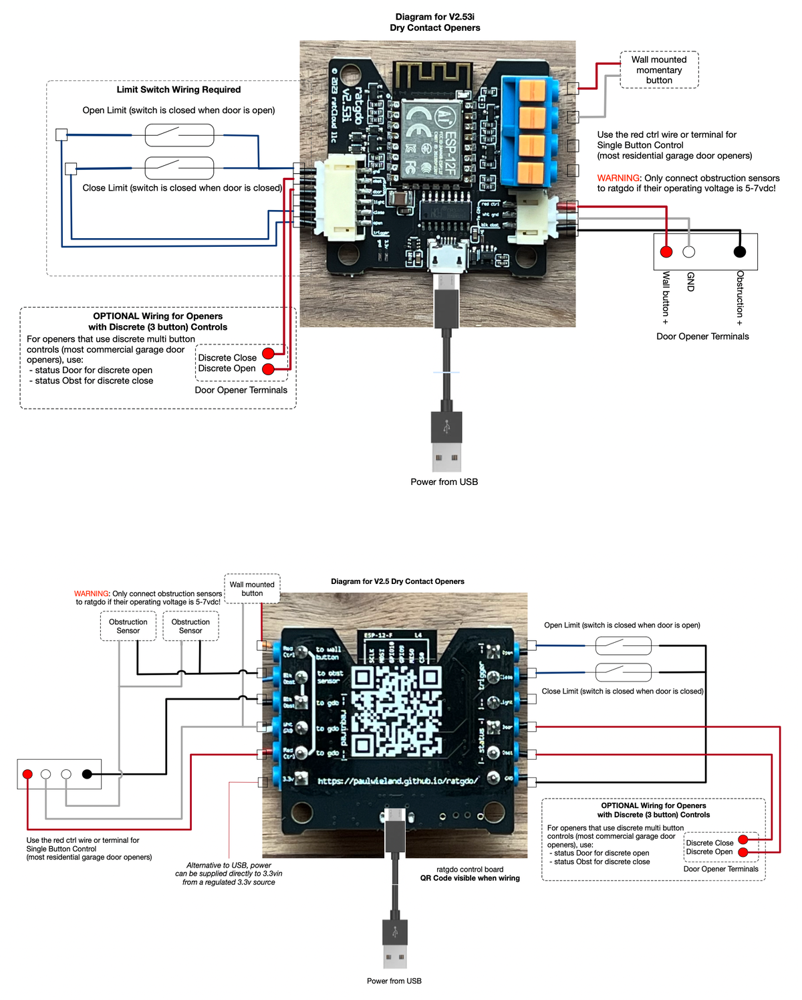
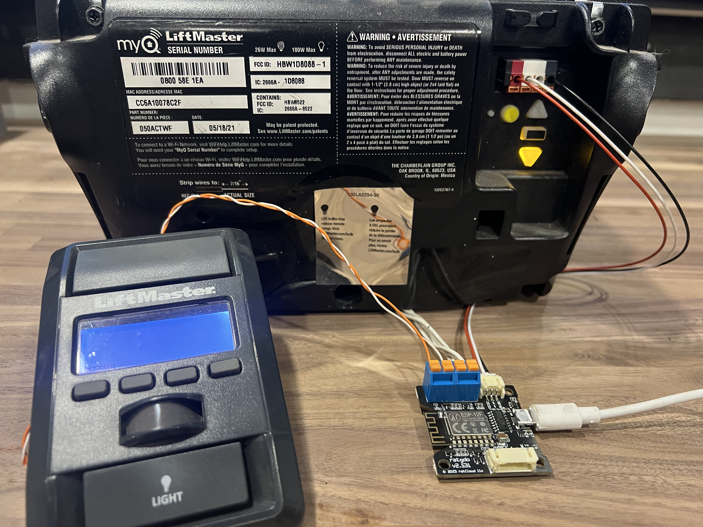

TOC
* [Main](index.md)
* [Features](01_features.md)
* [Configuration](02_configuration.md)
* [Wiring](03_wiring.md)
* [NodeRED MQTT / HomeKit Example](04_nodered_example.md)
* [Home Assistant Example](05_homeassistant_example.md)
* [FAQ & Troubleshooting](09_faq.md)

## Connecting ratgdo to your garage door opener
0. Make sure you have already [installed](flash.html) and [configured](02_configuration.md) the ratgdo firmware.
1. Unplug the door opener.
1. Connect the wires according to the diagram below
1. Plug the door opener back in
1. Power ratgdo with the USB power brick & cable.

* For Security + 2.0 door openers within **North America**, and for all compatible Security + 1.0 openers, connect the red, white & black terminals:
	* v2.52 &amp; v2.53 Security + 1/2 diagram 
	* v2.5  Security + 1/2 diagram 
* If your Security + 2.0 door opener has an eserial terminal (common outside of North America) connect the red/ctrl wire to eserial and **not** the red terminal. Only connect the black obstruction sensor wire if you have obstruction sensors.

* For Dry Contact door openers, you will need reed switches for door position status:
	* v2.5x dry contact diagram 

### Examples

Security + 1.0 & 2.0 openers using passthrough ports on control board (one wire per terminal):
v2.52 &amp; v2.53 (North America)

Rest of World Security + 2.0 Openers with e-serial terminal. Leave black obstruction wire disconnected unless you have obstruction sensors.

v2.5

Security + 1.0 & 2.0 openers with multiple wires sharing a terminal on GDO:

Suggested Mounting method using a zip tie to secure the control board to the plastic light shield:

Example wiring for a Genie opener which has user accessible limit switch terminals:

* Green wire = wht/gnd -> terminal 2 / ground
* Orange wire = red/ctrl -> terminal 1 / control
* Blue wire = trigger open -> terminal 4 / open limit switch
* White wire = trigger close -> terminal 6 / close limit switch

